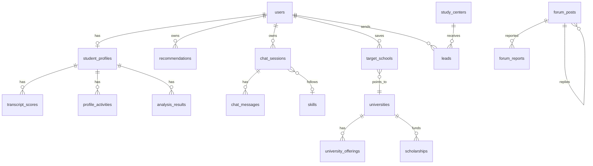

# Database

> Giải thích chi tiết từng bảng, từng cột và quan hệ: [DATABASE_GIAI_THICH.md](DATABASE_GIAI_THICH.md). Sơ đồ ERD: [database.drawio](database.drawio).

PostgreSQL 16 + pgvector, **một database `studyabroad`, hai schema**:

| Schema | Chủ sở hữu | Quản lý bằng |
|---|---|---|
| `app` | .NET API | **EF Core migrations** (thư mục `backend/src/StudyAbroad.Infrastructure/Persistence/Migrations`) |
| `advisor` | dịch vụ advisor (Python) | `advisor/sql/001_init.sql`, chỉ chứa vector cho RAG |

Quy tắc: .NET không đụng vào `advisor.*`, advisor không đụng vào `app.*`. Hai bên chỉ nói chuyện qua HTTP.

## Các bảng: 27 bảng trong schema `app`

Mọi bảng đều có `id` (uuid), `created_at`, `updated_at` (từ `BaseEntity`). Mỗi bảng là một file entity trong `Domain/Entities` và một file `<Tên>Configuration.cs` trong `Infrastructure/Persistence/Configurations`.

| Nhóm | Bảng |
|---|---|
| Tài khoản (5) | `users`, `otp_tokens`, `consents`, `audit_logs`, `notifications` |
| Hồ sơ (3) | `student_profiles` (học thuật + điểm thi + tài chính + tiến độ lộ trình), `transcript_scores`, `profile_activities` (ngoại khóa / kinh nghiệm / giải thưởng) |
| Trường, học bổng (4) | `universities`, `university_offerings` (theo bậc học: ngành, chi phí, điều kiện, hạn nộp), `scholarships`, `target_schools` |
| AI (9) | `recommendations`, `analysis_results`, `skills`, `chat_sessions`, `chat_messages`, `knowledge_documents`, `ai_calls`, `eval_cases`, `eval_runs` |
| Lộ trình, trung tâm, diễn đàn (5) | `roadmap_steps`, `study_centers`, `leads`, `forum_posts`, `forum_reports` |
| Cấu hình (1) | `app_settings` (trọng số gợi ý, bảng quy đổi điểm, trọng số môn theo ngành, luật kiểm duyệt) |



### Những chỗ đã gộp (để biết dữ liệu nằm đâu)

| Thứ cần lưu | Nằm ở |
|---|---|
| Điểm IELTS, TOEFL, SAT, GRE... | cột trên `student_profiles`; điểm thành phần ở `other_tests_json` |
| Ngân sách, nguồn tiền, bang muốn học | cột trên `student_profiles` |
| Tiến độ lộ trình của từng người | `student_profiles.roadmap_progress_json` |
| Ngành, học phí, điều kiện đầu vào, hạn nộp của trường | `university_offerings` (một dòng cho mỗi trường × bậc học) |
| Danh sách trường AI gợi ý và lý do | `recommendations.items_json` |
| Chiến lược cải thiện hồ sơ | `analysis_results` với `kind = strategy` |
| Phiên bản flow tư vấn | `skills` (cùng `key`, khác `version`) |
| Câu hỏi AI chưa trả lời được | `chat_messages.review_status = open` |
| Trung tâm AI gợi ý khi chuyển | `chat_messages.suggested_centers_json` |
| Chủ đề diễn đàn và trả lời | đều là `forum_posts`; bài gốc có `parent_post_id = null` |
| Kết quả từng câu khi chạy đánh giá AI | `eval_runs.results_json` |
| Lịch sử đăng nhập, xác minh trung tâm, khóa tài khoản | `audit_logs` |
| Bảng quy đổi điểm, trọng số, luật kiểm duyệt | `app_settings` (key/value JSON) |

### Cố tình chưa có

- Nhóm "Dự phòng" của backlog (checklist hồ sơ, tệp tải lên, hạn chế người dùng, đánh giá trung tâm) và các chức năng sau đồ án (bài luận, báo cáo PDF...): khi nào làm thì thêm bằng migration riêng.
- Thanh toán, hợp đồng, gói trả phí: đã loại khỏi phạm vi.
- `roles`, `sessions`: vai trò là cột `users.role`, phiên đăng nhập dùng token.
- `providers`: chính là bảng `study_centers` có sẵn.

## Quy ước khi thêm hoặc sửa bảng

1. Thêm entity vào `Domain/Entities`, cấu hình vào `Infrastructure/Persistence/Configurations`, thêm `DbSet` vào `AppDbContext`.
2. Tạo migration:
   ```powershell
   cd backend
   dotnet ef migrations add TenMigration -p src/StudyAbroad.Infrastructure -s src/StudyAbroad.Api -o Persistence/Migrations
   ```
   Đặt tên theo việc làm: `AddScholarships`, `AddProviders`. Mỗi PR một migration.
3. Mở file migration vừa sinh và đọc qua trước khi commit. Commit cả file `*.Designer.cs` và `AppDbContextModelSnapshot.cs`.
4. **Không sửa migration đã merge vào `develop`.** Muốn đổi thì tạo migration mới.
5. Hai người cùng thêm migration một lúc sẽ xung đột `AppDbContextModelSnapshot.cs`. Người merge sau: `git pull`, xóa migration của mình (`dotnet ef migrations remove`), rồi tạo lại.
6. Không dùng `DROP COLUMN` hoặc đổi kiểu cột trên bảng đã có dữ liệu thật mà không báo cả nhóm.

Áp dụng migration: API tự chạy khi khởi động nếu `Database:MigrateOnStartup` là `true` (mặc định ở Development). Chạy tay: `dotnet ef database update -p src/StudyAbroad.Infrastructure -s src/StudyAbroad.Api`.

## Ghi chú thiết kế

- Cột JSON (`criteria_json`, `result_json`, `definition_json`, `sources_json`...) dùng kiểu `jsonb`, trong C# là `string`.
- Mảng (`study_levels`, `services`, `preferred_states`, `majors`) dùng `text[]`.
- Bậc học luôn là một trong `StudyLevels` (`secondary`, `community_college`, `undergraduate`, `master`, `phd`). Giữ đồng bộ với `advisor` và frontend.
- `knowledge_documents` là bản gốc có kiểm chứng (mỗi dòng "Đã kiểm chứng" ở sheet 05 của file dữ liệu tư vấn). Script nạp sẽ embed rồi ghi vào `advisor.documents`.
- Xóa user thì xóa hồ sơ, gợi ý và chat của user đó. `audit_logs` và `ai_calls` giữ lại; bài diễn đàn giữ lại nhưng mất tên tác giả.
