# CAPSTONE PROJECT REPORT 3 (SRS) – OFFICIAL CONTRIBUTION
## SECTION I.3 (OVERALL SYSTEM CONCEPTUAL DATA MODEL), SECTION II & SECTION III
**Author:** Nguyen Xuan Duc (Student ID: HE186870)  
**Role:** Developer (Assigned to construct Overall Conceptual Data Model & Profile/Academic Features)  
**Project:** USAS – Study Abroad Decision Support System for US Education  
**Sprint:** Sprint 1 (Delivery deadline: Before 08/10/2026)  
**Assigned Tasks in Plan:**  
- **DOC-15:** SRS I.3 Conceptual Data Model: ERD tổng thể toàn hệ thống, mô tả entity, quy tắc dữ liệu (Đức viết bản đầu tiên cho cả nhóm)  
- **DOC-16:** SRS II Use Case Specifications (#3, #4)  
- **DOC-17:** SRS III Functional Requirements & Screen Specifications (#3, #4)  

---

# I. Overall Requirements

## 3. Conceptual Data Model

### 3.1 Entity Relationship Diagram (ERD) – Entire USAS System
*Note: This diagram models the comprehensive conceptual architecture of the entire USAS system across all 6 core sub-domains (Authentication, Student Profile, University & Offerings, AI Advisory & Recommendations, Roadmap & Study Centers, Community Forum). Relationships are expressed using Crow-Foot notation with business verb-ing labels adhering to FPT University Capstone Guidelines.*

```mermaid
erDiagram
    users ||--o| student_profiles : "maintaining (1-1)"
    student_profiles ||--o{ transcript_scores : "recording (1-n)"
    student_profiles ||--o{ profile_activities : "participating (1-n)"
    student_profiles ||--o{ analysis_results : "generating (1-n)"
    
    users ||--o{ recommendations : "receiving (1-n)"
    student_profiles ||--o{ recommendations : "evaluating (1-n)"
    
    users ||--o{ target_schools : "shortlisting (1-n)"
    target_schools }o--|| universities : "targeting (n-1)"
    universities ||--o{ university_offerings : "offering (1-n)"
    universities ||--o{ scholarships : "sponsoring (1-n)"
    
    users ||--o{ chat_sessions : "initiating (1-n)"
    chat_sessions ||--o{ chat_messages : "containing (1-n)"
    chat_sessions }o--o| skills : "following (n-1)"
    
    users ||--o{ leads : "submitting (1-n)"
    study_centers ||--o{ leads : "receiving (1-n)"
    users ||--o{ study_centers : "managing (1-n)"
    
    users ||--o{ forum_posts : "authoring (1-n)"
    forum_posts ||--o{ forum_posts : "replying (1-n)"
    forum_posts ||--o{ forum_reports : "flagging (1-n)"
    
    users ||--o{ consents : "granting (1-n)"
    users ||--o{ otp_tokens : "requesting (1-n)"
    users ||--o{ notifications : "receiving (1-n)"
    users ||--o{ knowledge_documents : "reviewing (1-n)"

    users {
        uuid id PK
        string email UK
        string full_name
        string role "student | parent | center_manager | admin"
        string status "active | inactive | locked"
        timestamp created_at
    }

    student_profiles {
        uuid id PK
        uuid user_id FK "UK (1-1)"
        string target_level "secondary | undergraduate | master | phd"
        string grade_scale "10 | 4 | 100"
        decimal overall_gpa
        decimal annual_budget_usd
        string funding_source "family | loan | scholarship | other"
        boolean needs_scholarship
        string roadmap_progress_json
        timestamp created_at
    }

    transcript_scores {
        uuid id PK
        uuid student_profile_id FK
        string term_name "e.g. Grade 10 Sem 1"
        int term_order "1 to 20"
        string subject
        decimal score "0.0 to 10.0"
        decimal credits
        timestamp created_at
    }

    profile_activities {
        uuid id PK
        uuid student_profile_id FK
        string kind "extracurricular | award | experience"
        string title
        string organization
        string role
        string start_date
        string end_date
        text description
        timestamp created_at
    }

    analysis_results {
        uuid id PK
        uuid student_profile_id FK
        string kind "gpa | strengths_weaknesses | strategy"
        jsonb result_json
        string model_version "usas-gpa-v1.0"
        timestamp created_at
    }

    universities {
        uuid id PK
        string name UK
        string state
        string institution_type "public | private"
        decimal average_gpa
        timestamp created_at
    }

    university_offerings {
        uuid id PK
        uuid university_id FK
        string study_level
        string major_name
        decimal annual_tuition_usd
        string application_deadline
    }

    scholarships {
        uuid id PK
        uuid university_id FK
        string title
        decimal award_amount_usd
        decimal min_gpa_required
    }

    target_schools {
        uuid id PK
        uuid user_id FK
        uuid university_id FK
        string status "considering | applying | accepted"
        timestamp created_at
    }

    recommendations {
        uuid id PK
        uuid user_id FK
        uuid student_profile_id FK
        jsonb items_json "Reach / Match / Safety list"
        string model_version
        timestamp created_at
    }

    chat_sessions {
        uuid id PK
        uuid user_id FK
        uuid skill_id FK
        string session_title
        timestamp created_at
    }

    chat_messages {
        uuid id PK
        uuid chat_session_id FK
        string role "user | assistant | system"
        text content
        jsonb suggested_centers_json
        timestamp created_at
    }

    skills {
        uuid id PK
        string key "visa_f1 | undergrad_admission"
        int version
        jsonb definition_json
    }

    study_centers {
        uuid id PK
        uuid owner_user_id FK
        string name UK
        string phone
        string email
        string verification_status "unverified | verified | rejected"
        timestamp created_at
    }

    leads {
        uuid id PK
        uuid user_id FK
        uuid study_center_id FK
        string student_name
        string phone
        string status "new | contacted | enrolled"
        timestamp created_at
    }

    forum_posts {
        uuid id PK
        uuid author_user_id FK
        uuid parent_post_id FK
        string title
        text content
        timestamp created_at
    }

    forum_reports {
        uuid id PK
        uuid post_id FK
        uuid reporter_user_id FK
        string reason
        string status "pending | reviewed"
    }

    consents {
        uuid id PK
        uuid user_id FK
        string purpose "lead_sharing | ai_processing"
        boolean granted
        timestamp granted_at
    }

    otp_tokens {
        uuid id PK
        uuid user_id FK
        string code_hash
        string purpose "register | reset_password"
        timestamp expires_at
    }

    notifications {
        uuid id PK
        uuid user_id FK
        string title
        string content
        timestamp read_at
    }

    knowledge_documents {
        uuid id PK
        string title
        text content
        string source_url
        string verification_status
    }

    app_settings {
        uuid id PK
        string key UK "grade_scale.10 | recommend.weights"
        jsonb value_json
        string description
    }
```



*Operational & Evaluation Tables (Standalone/Audit):*  
- `audit_logs` (Tracks login, account locking, data export actions; retained permanently).  
- `ai_calls` (Monitors latency, token consumption, and errors for LLM invocations).  
- `eval_cases` & `eval_runs` (Automated benchmarks testing recommendation accuracy across golden datasets).  
- `roadmap_steps` (Canonical timeline milestones B0 to B6 for US study preparation).  

---

### 3.2 Entity Descriptions (Comprehensive Specifications for All 27 System Entities)

#### Domain 1: Authentication & System Operations (5 Entities)

##### Entity 1: User (`users`)
| Field | Value |
| :--- | :--- |
| **Purpose** | Central identity entity for any person accessing USAS, regardless of system role (student, parent, study center manager, administrator). |
| **Key business attributes** | `email`, `password_hash`, `full_name`, `role` (`student` \| `parent` \| `center_manager` \| `admin`), `status` (`active` \| `inactive` \| `locked`), `parent_acknowledged`. |
| **Business identity** | `email` is globally unique. `id` serves as system-wide primary key. Root parent table for all operational data. |
| **Status / lifecycle** | Created upon registration $\r->$ `active` upon OTP verification $\r->$ `locked` after repeated failed logins $\r->$ `inactive` upon deactivation. |

##### Entity 2: OtpToken (`otp_tokens`)
| Field | Value |
| :--- | :--- |
| **Purpose** | Manages one-time authentication codes used for email verification during account registration and secure self-service password reset. |
| **Key business attributes** | `user_id`, `purpose` (`verify_email` \| `reset_password`), `code_hash`, `expires_at`, `used_at`, `attempts`. |
| **Business identity** | Unique primary key `id`. Belongs to exactly one `user_id` (Cascade Delete upon user removal). |
| **Status / lifecycle** | Generated with 5-minute expiration $\r->$ Invalidated upon first successful verification (`used_at` recorded) or locked after 5 failed attempts. |

##### Entity 3: Consent (`consents`)
| Field | Value |
| :--- | :--- |
| **Purpose** | Records explicit, legally binding user authorizations for candidate data processing, profile transmission to external study centers, and forum guidelines. |
| **Key business attributes** | `user_id`, `purpose` (`privacy` \| `share_with_center` \| `forum_rules`), `granted`, `policy_version`, `created_at`. |
| **Business identity** | Unique primary key `id`. Linked to `user_id`. Required as a foreign key precondition in `leads` before candidate data is dispatched. |
| **Status / lifecycle** | Granted by applicant during onboarding or counseling request $\r->$ Retained permanently as compliance audit $\r->$ Set `granted = false` if revoked. |

##### Entity 4: AuditLog (`audit_logs`)
| Field | Value |
| :--- | :--- |
| **Purpose** | System-wide immutable security ledger tracking administrative operations, authentication events, center verifications, and moderation actions. |
| **Key business attributes** | `actor_user_id`, `action` (`login_ok`, `login_failed`, `user.lock`, `center.verify`, `post.hide`), `entity_type`, `entity_id`, `detail_json`, `ip_address`, `user_agent`. |
| **Business identity** | Unique primary key `id`. Decoupled without foreign key constraints to ensure audit integrity even if the actor account is subsequently deleted. |
| **Status / lifecycle** | Append-only record $\r->$ Modifications and physical deletions are programmatically blocked by database access controls. |

##### Entity 5: Notification (`notifications`)
| Field | Value |
| :--- | :--- |
| **Purpose** | Stores and delivers in-app alerts, counseling inquiry status updates, university admission deadline reminders, and community moderation notices. |
| **Key business attributes** | `user_id`, `type` (`lead_status`, `deadline_reminder`, `security`), `title`, `body`, `link_url`, `read_at`, `created_at`. |
| **Business identity** | Unique primary key `id`. Belongs to `user_id` (Cascade Delete). |
| **Status / lifecycle** | Created by background events $\r->$ Unread (`read_at` is null) $\r->$ Marked read when viewed by user $\r->$ Archived after 90 days. |

---

#### Domain 2: Student Profile & Academic Readiness (4 Entities)

##### Entity 6: StudentProfile (`student_profiles`)
| Field | Value |
| :--- | :--- |
| **Purpose** | Master candidate profile aggregating study targets, academic GPA, standardized test scores, financial budget, and roadmap progression for decision-support evaluation. |
| **Key business attributes** | `user_id`, `target_level`, `intended_major`, `grade_scale`, `overall_gpa`, `ielts`, `toefl`, `sat`, `annual_budget_usd`, `funding_source`, `needs_scholarship`, `preferred_states`, `roadmap_progress_json`. |
| **Business identity** | Unique 1-to-1 relationship with `users` (`user_id` has unique index). Primary key `id`. Parent entity for scores, activities, and analysis results. |
| **Status / lifecycle** | Initialized upon onboarding $\r->$ Continuously updated by student during counseling $\r->$ Cascades on user deletion. |

##### Entity 7: TranscriptScore (`transcript_scores`)
| Field | Value |
| :--- | :--- |
| **Purpose** | Captures detailed semester-by-semester subject grades to evaluate academic consistency, subject group proficiency (STEM, Social, Languages), and long-term grade trends. |
| **Key business attributes** | `student_profile_id`, `term_name`, `term_order` (1 to 20), `subject`, `score` (0.00 – 10.00), `credits`. |
| **Business identity** | Unique primary key `id`. Logically unique by composite key `(student_profile_id, term_order, subject)`. |
| **Status / lifecycle** | Persisted in batches by student $\r->$ Evaluated during academic GPA analysis $\r->$ Cascades on profile deletion. |

##### Entity 8: ProfileActivity (`profile_activities`)
| Field | Value |
| :--- | :--- |
| **Purpose** | Stores extracurricular activities, academic/sports awards, and leadership experiences used by the AI engine to evaluate holistic profile competitiveness. |
| **Key business attributes** | `student_profile_id`, `kind` (`extracurricular` \| `award` \| `experience`), `title`, `organization`, `role`, `start_date`, `end_date`, `description`. |
| **Business identity** | Unique primary key `id`. Belongs to exactly one `student_profile_id`. |
| **Status / lifecycle** | Created and edited by applicant $
->$ Permanent until candidate edits or removes $
->$ Cascades on profile deletion. |

##### Entity 9: AnalysisResult (`analysis_results`)
| Field | Value |
| :--- | :--- |
| **Purpose** | Stores deterministic analytical outputs including WES 4.0 GPA conversions, subject group proficiencies, and 3-year performance growth trends. |
| **Key business attributes** | `student_profile_id`, `kind` (`gpa` \| `strengths_weaknesses` \| `strategy`), `result_json`, `model_version` (`usas-gpa-v1.0`). |
| **Business identity** | Unique primary key `id`. Latest historical snapshot identified by `created_at` timestamp. |
| **Status / lifecycle** | Generated on-demand upon student request $\r->$ Append-only audit history $\r->$ Cascades on profile deletion. |

---

#### Domain 3: US Institutions, Offerings & Scholarships (4 Entities)

##### Entity 10: University (`universities`)
| Field | Value |
| :--- | :--- |
| **Purpose** | Catalogs US higher education institutions eligible for admissions and scholarship matching, storing institutional-level profiles independent of study level. |
| **Key business attributes** | `code`, `name`, `city`, `state`, `website`, `control` (`public` \| `private`), `acceptance_rate`, `international_student_count`, `is_active`. |
| **Business identity** | Unique primary key `id`. Institution `code` and `name` are unique. Parent of offerings, target schools, and scholarships. |
| **Status / lifecycle** | Seeded by system administrator via data pipeline $\r->$ Maintained per admissions cycle $\r->$ Soft-deletable via `is_active = false`. |

##### Entity 11: UniversityOffering (`university_offerings`)
| Field | Value |
| :--- | :--- |
| **Purpose** | Captures degree-level specific tuition fees, living costs, minimum admission criteria (GPA, IELTS/TOEFL), SAT policies, and application deadlines per major. |
| **Key business attributes** | `university_id`, `study_level`, `majors`, `stem_majors`, `academic_year`, `tuition_usd`, `living_usd`, `fees_usd`, `min_gpa4`, `min_ielts`, `sat_policy`, `deadlines_json`. |
| **Business identity** | Unique primary key `id`. Logically unique by composite pair `(university_id, study_level)`. |
| **Status / lifecycle** | Updated annually by admissions data team $\r->$ Consumed by recommendation engine $\r->$ Cascades on university deletion. |

##### Entity 12: Scholarship (`scholarships`)
| Field | Value |
| :--- | :--- |
| **Purpose** | Catalogs institutional and external scholarship programs available for international applicants, detailing grant amounts, coverage, and eligibility requirements. |
| **Key business attributes** | `university_id` (nullable for independent awards), `name`, `provider`, `study_level`, `amount_usd`, `coverage_type`, `min_gpa4`, `min_ielts`, `deadline`, `is_active`. |
| **Business identity** | Unique primary key `id`. Belongs optionally to a sponsoring `university_id` (SetNull on delete). |
| **Status / lifecycle** | Verified by content team $\r->$ Active for applicant discovery $\r->$ Set `is_active = false` when application window closes. |

##### Entity 13: TargetSchool (`target_schools`)
| Field | Value |
| :--- | :--- |
| **Purpose** | Tracks an applicant's personalized shortlist of prioritized US institutions, categorized into Dream, Target, and Safety tiers with application milestones. |
| **Key business attributes** | `user_id`, `university_id`, `tier` (`dream` \| `target` \| `safety`), `status` (`considering` \| `applying` \| `admitted` \| `rejected`), `application_deadline`, `notes`. |
| **Business identity** | Unique primary key `id`. Enforces unique composite constraint `(user_id, university_id)`. |
| **Status / lifecycle** | Added by candidate from search or AI recommendations $\r->$ Progresses through admissions lifecycle $\r->$ Cascades on user deletion. |

---

#### Domain 4: AI Decision Support & Advisory Engine (6 Entities)

##### Entity 14: Recommendation (`recommendations`)
| Field | Value |
| :--- | :--- |
| **Purpose** | Preserves AI-generated university recommendations categorized into Reach, Match, and Safety tiers, accompanied by explainable justifications and fit scores. |
| **Key business attributes** | `user_id`, `student_profile_id`, `study_level`, `criteria_json` (major, state, budget), `items_json` (university ID, rank, tier, score, reason), `algorithm_version`. |
| **Business identity** | Unique primary key `id`. New immutable recommendation record generated on each recommendation run. |
| **Status / lifecycle** | Created upon recommendation generation $\r->$ Retained for student comparison history $\r->$ Cascades on user deletion. |

##### Entity 15: ChatSession (`chat_sessions`)
| Field | Value |
| :--- | :--- |
| **Purpose** | Manages multi-turn counseling conversations between applicants and the AI Advisor RAG pipeline, tracking dialog history and current counseling milestone. |
| **Key business attributes** | `user_id`, `skill_id`, `title`, `study_level`, `current_step`, `created_at`, `updated_at`. |
| **Business identity** | Unique primary key `id`. Belongs to `user_id` and optional structured advisory `skill_id`. |
| **Status / lifecycle** | Initiated when applicant opens chat $\r->$ Progresses across dialog turns $\r->$ Parent of `chat_messages` (Cascade Delete). |

##### Entity 16: ChatMessage (`chat_messages`)
| Field | Value |
| :--- | :--- |
| **Purpose** | Stores individual conversational turns within an AI counseling session, including retrieved knowledge citations, suggested study centers, and moderation flags. |
| **Key business attributes** | `chat_session_id`, `role` (`user` \| `assistant` \| `system`), `content`, `step`, `sources_json`, `suggested_centers_json`, `review_status` (`none` \| `open` \| `resolved`). |
| **Business identity** | Unique primary key `id`. Belongs strictly to `chat_session_id`. |
| **Status / lifecycle** | Appended sequentially $\r->$ Immutable dialog history $\r->$ Flagged for human expert review if escalated (`review_status = open`). |

##### Entity 17: Skill (`skills`)
| Field | Value |
| :--- | :--- |
| **Purpose** | Defines structured multi-step advisory workflows (e.g., F-1 Visa preparation, Undergrad Admission Roadmap) executed by the AI counselor. |
| **Key business attributes** | `key` (`visa_f1`, `undergrad_admission`), `version`, `name`, `description`, `definition_json`, `is_active`. |
| **Business identity** | Unique primary key `id`. Unique constraint on composite pair `(key, version)`. |
| **Status / lifecycle** | Configured by AI system engineers $\r->$ Versioned upon workflow update $\r->$ Active skills selectable by users in chat. |

##### Entity 18: KnowledgeDocument (`knowledge_documents`)
| Field | Value |
| :--- | :--- |
| **Purpose** | Stores verified policy documents, visa regulations, and university admissions criteria used by the vector store for Retrieval-Augmented Generation (RAG). |
| **Key business attributes** | `title`, `source_url`, `doc_type`, `study_level`, `content`, `retrieved_at`, `status` (`pending` \| `verified` \| `rejected`), `verified_by_user_id`, `ingested_at`. |
| **Business identity** | Unique primary key `id`. Linked to reviewing administrator via `verified_by_user_id`. |
| **Status / lifecycle** | Scraped or uploaded $\r->$ Verified by admin $\r->$ Vectorized into AI knowledge base $\r->$ Replaced when regulations update. |

##### Entity 19: AiCall (`ai_calls`)
| Field | Value |
| :--- | :--- |
| **Purpose** | Telemetry and observability ledger recording token usage, model identifiers, execution latency, and error traces for all LLM service invocations. |
| **Key business attributes** | `user_id`, `kind` (`chat` \| `recommendation` \| `profile_eval`), `model`, `prompt_tokens`, `completion_tokens`, `latency_ms`, `success`, `error`. |
| **Business identity** | Unique primary key `id`. Decoupled logging entity. |
| **Status / lifecycle** | Asynchronously recorded upon LLM API completion $\r->$ Permanent operational audit for cost and latency monitoring. |

---

#### Domain 5: AI Model Evaluation & Benchmarking (2 Entities)

##### Entity 20: EvalCase (`eval_cases`)
| Field | Value |
| :--- | :--- |
| **Purpose** | Curated golden dataset of representative candidate counseling inquiries and profile scenarios with verified expected answers, used for automated evaluation. |
| **Key business attributes** | `question`, `expected_answer`, `study_level`, `category`, `expected_sources_json`, `is_active`. |
| **Business identity** | Unique primary key `id`. Maintained by QA and AI engineering teams. |
| **Status / lifecycle** | Created during test suite design $\r->$ Active during evaluation cycles $\r->$ Versioned alongside curriculum updates. |

##### Entity 21: EvalRun (`eval_runs`)
| Field | Value |
| :--- | :--- |
| **Purpose** | Captures execution summaries and accuracy metrics (BLEU, ROUGE, latency, pass rate) from automated benchmark test suites running against the AI Advisor. |
| **Key business attributes** | `name`, `model_version`, `skill_id`, `total_cases`, `passed_cases`, `results_json`, `started_at`, `finished_at`, `notes`. |
| **Business identity** | Unique primary key `id`. Immutable benchmark execution report. |
| **Status / lifecycle** | Generated on-demand or via CI/CD test pipelines $\r->$ Retained permanently for model regression tracking. |

---

#### Domain 6: Study Centers, Community & System Configuration (6 Entities)

##### Entity 22: StudyCenter (`study_centers`)
| Field | Value |
| :--- | :--- |
| **Purpose** | Represents licensed study abroad consulting agencies registered to receive qualified student connection leads after administrative credential verification. |
| **Key business attributes** | `code`, `name`, `website`, `address`, `city`, `study_levels`, `services`, `phone`, `email`, `verification_status` (`pending` \| `verified` \| `rejected`), `verified_by_user_id`, `owner_user_id`, `is_active`. |
| **Business identity** | Unique primary key `id`. Unique institutional `code` and `name`. Linked to agency account `owner_user_id`. |
| **Status / lifecycle** | Self-registered (`pending`) $\r->$ Verified by admin (`verified`) $\r->$ Active for lead routing $\r->$ Deactivated if complaints occur. |

##### Entity 23: Lead (`leads`)
| Field | Value |
| :--- | :--- |
| **Purpose** | Manages qualified applicant connection inquiries dispatched to verified consulting centers, requiring verified user consent. |
| **Key business attributes** | `user_id`, `study_center_id`, `consent_id`, `study_level`, `contact_phone`, `message`, `shared_profile`, `status` (`new` \| `contacted` \| `enrolled` \| `rejected`). |
| **Business identity** | Unique primary key `id`. Connects student `user_id`, `study_centers.id`, and `consents.id`. |
| **Status / lifecycle** | Submitted by candidate (`new`) $\r->$ Center contacts applicant (`contacted`) $\r->$ Consultation completed (`enrolled` or `rejected`). |

##### Entity 24: ForumPost (`forum_posts`)
| Field | Value |
| :--- | :--- |
| **Purpose** | Stores community discussion threads, questions, and replies regarding study abroad admissions, visa interviews, and campus experiences. |
| **Key business attributes** | `user_id`, `parent_post_id` (self-referencing FK for replies), `title`, `study_level`, `category`, `content`, `is_ai_generated`, `is_pinned`, `status` (`published` \| `hidden` \| `deleted`). |
| **Business identity** | Unique primary key `id`. Self-referencing recursive relationship enables hierarchical discussion threads. |
| **Status / lifecycle** | Created by user $\r->$ Published immediately $\r->$ Pinned by moderator or hidden if flagged for policy violations. |

##### Entity 25: ForumReport (`forum_reports`)
| Field | Value |
| :--- | :--- |
| **Purpose** | Tracks community violation reports submitted by users against inappropriate forum posts for administrative moderation review. |
| **Key business attributes** | `forum_post_id`, `reporter_user_id`, `reason`, `detail`, `status` (`pending` \| `resolved` \| `dismissed`), `handled_by_user_id`, `handled_at`. |
| **Business identity** | Unique primary key `id`. Links target `forum_posts.id` with reporter `users.id`. |
| **Status / lifecycle** | Submitted by user (`pending`) $\r->$ Reviewed by moderator $\r->$ Resolved (post hidden) or dismissed as invalid. |

##### Entity 26: RoadmapStep (`roadmap_steps`)
| Field | Value |
| :--- | :--- |
| **Purpose** | Master timeline template defining standardized preparation milestones (Step B0 to B6) for international study in the United States. |
| **Key business attributes** | `study_level`, `step_key` (`B0_orientation`, `B1_profile`, `B2_test_prep`, `B3_school_selection`, `B4_application`, `B5_visa`, `B6_departure`), `title`, `description`, `sort_order`, `months_before_start`, `resources_json`. |
| **Business identity** | Unique primary key `id`. Unique composite constraint on `(study_level, step_key)`. |
| **Status / lifecycle** | Seeded master template $\r->$ Referenced by student profile roadmap progress $\r->$ Maintained by admissions specialists. |

##### Entity 27: AppSetting (`app_settings`)
| Field | Value |
| :--- | :--- |
| **Purpose** | Master configuration repository storing dynamic system parameters such as the Vietnam 10.0 to US 4.0 grade scale mapping table and AI recommendation weighting factors. |
| **Key business attributes** | `key` (`grade_scale.10`, `recommend.weights`), `value_json`, `description`, `created_at`, `updated_at`. |
| **Business identity** | Unique primary key `id`. Globally unique configuration `key`. |
| **Status / lifecycle** | Initialized during database migration $\r->$ Modified only by system administrators $\r->$ Dynamically evaluated at runtime by analysis engines. |

---

### 3.3 Data Business Rules
[Rules about data that are not obvious from the ERD. ]
| Rule | Description | Enforced On |
| :--- | :--- | :--- |
| **Single active profile** | Each registered student account is restricted to at most one student profile. Duplicate profile creations for the same user are rejected. | Profile creation |
| **Non-negative annual budget** | The declared annual educational budget must be a non-negative decimal value ($\ge 0$). Entering $0$ indicates reliance on full scholarships or financial aid. | Financial profile save and update |
| **Valid funding source** | The primary funding channel must be selected from predefined domain options: Family, Loan, Scholarship, or Other. | Financial profile save and update |
| **Valid activity classification** | Each profile activity or achievement must be classified into one of three predefined categories: Extracurricular, Award, or Experience. | Activity creation and update |
| **Activity date sequence** | An activity or award must have a non-empty title. If an end date is provided, it cannot precede the start date. | Activity creation and update |
| **Valid Vietnam grade scale range** | All subject scores entered in the transcript must fall within the range of $0.00$ to $10.00$ inclusive. Negative values or values exceeding $10.00$ are strictly rejected. | Transcript score insertion and update |
| **Sequential semester order** | Semester order (`term_order`) must be an integer between $1$ and $20$, strictly representing chronological high school or college progression (e.g., Grade 10 Sem 1 = 1). | Transcript score insertion |
| **Positive course credits** | When credits are specified, course credits must be strictly positive values ($> 0.0$ and $\le 30.0$). Standard high school subjects default to $1.0$. | Transcript score insertion |
| **No duplicate subject per semester** | A student cannot have duplicate subject entries within the same semester. | Transcript score insertion and batch save |
| **Deterministic WES 4.0 conversion** | Subject grade conversion from Vietnam 10.0 scale to US 4.0 scale must adhere strictly to WES standards: [9.0 - 10.0] -> 4.0 (A), [8.0 - 8.9] -> 3.5 (B+), [7.0 - 7.9] -> 3.0 (B), [6.0 - 6.9] -> 2.5 (C+), [5.0 - 5.9] -> 2.0 (C), [0.0 - 4.9] -> 0.0 (F). Identical inputs must yield identical outputs. | Academic analysis service execution |
| **Dual GPA computation** | The system must calculate both Unweighted GPA (arithmetic mean of 4.0 converted scores) and Weighted GPA (credit/weight-adjusted average). | Academic analysis service execution |
| **Subject discipline classification** | Subjects must be deterministically classified into STEM (Math, Physics, Chemistry, Biology, Informatics), Social Sciences (Literature, History, Geography, Civics), and Languages (English, Foreign Languages) to compute group averages. | Academic analysis service execution |
| **3-year academic trend evaluation** | Chronological semester GPAs across at least 3 semesters are evaluated using linear regression slope to classify performance trend as Upward Trend (slope $\ge +0.05$), Downward Trend (slope $\le -0.05$), or Consistent. | Academic analysis service execution |
| **Overall GPA synchronization** | Upon completing academic analysis, the calculated unweighted GPA must automatically update and synchronize to the student profile record (`student_profiles.overall_gpa`). | Academic analysis completion |
| **Student profile ownership isolation** | A student can only view, modify, or delete transcript scores, financial records, and activities belonging strictly to their own account. Direct ID parameter tampering is rejected with HTTP 403 Forbidden. | All profile and academic API requests |


---

# II. Use Case Specifications

## 1. Profile & Academic Management Features

### 1.3 Manage Financial Profile & Extracurricular Activities

| Primary Actors | Student | Secondary Actors | None |
| :--- | :--- | :--- | :--- |
| **Description** | As a user, I want to manage my educational financial profile and extracurricular activities so that the system can assess my financial feasibility and holistic profile competitiveness for US university admissions. | <td colspan=3/> |
| **Preconditions** | User account has been created & authorized, and user has logged into the system. | <td colspan=3/> |
| **Normal Flow** | **Manage Financial Profile & Extracurricular Activities**<br>1. User clicks Financial & Activities menu from the page header or navigation bar<br>2. System shows the Financial & Activities Profile management screen<br>3. User types in financial information (annual educational budget in USD, primary funding source, sponsor relationship, proof documents)<br>4. User types in extracurricular activities (activity title, category, role/organization, start date, end date, description)<br>5. User clicks the Save Profile button<br>6. System validates the financial details and activity information (GB-02, GB-03, GB-04, GB-05)<br>7. System saves the financial profile and extracurricular activities into the database<br>8. System tracks user’s profile update to the Activity Log<br>9. System shows the success notification message (MSG-FIN-01) and refreshes the displayed information | <td colspan=3/> |
| **Alternative Flows** | **Step 3.1_Zero budget declaration**<br>a. User types in $0 for the annual educational budget<br>b. System checks whether primary funding source is Scholarship or need-based aid is requested<br>c. System displays an informational note that a zero-budget profile relies on full scholarships or need-based financial aid<br>d. Return to step 4 of normal flow.<br><br>**Step 4.1_Delete an existing extracurricular activity**<br>a. User clicks Delete button on a specific activity item in the list<br>b. System displays a confirmation popup<br>c. User confirms the deletion<br>d. System removes the activity record from the database and tracks deletion to the Activity Log<br>e. System updates the activity list without reloading the page<br><br>**Step 5.1_System can’t save the financial profile**<br>User can’t save financial profile & get relevant error message in one of below cases:<br>• He/she leaves the Annual Budget field blank (MSG-FIN-02)<br>• Input Annual Budget is a negative value (MSG-FIN-03)<br>• Input Annual Budget contains non-numeric characters (MSG-FIN-04)<br>• He/she leaves the Primary Funding Source unselected (MSG-FIN-05)<br><br>**Step 5.2_System can’t save extracurricular activity**<br>User can’t save extracurricular activity & get relevant error message in one of below cases:<br>• He/she leaves the Activity Title field blank (MSG-ACT-01)<br>• Input End Date is earlier than Start Date (MSG-ACT-02)<br>• Input Activity Title exceeds 200 characters (MSG-ACT-03)<br>• Input Description exceeds 1,000 characters (MSG-ACT-04)<br><br>**Step 5.3_System connection error**<br>• System encounters unexpected database or network failure while saving data (MSG-SYS-01)<br>• System keeps all entered data in the form for user to retry | <td colspan=3/> |
| **Postconditions** | User saves financial profile and extracurricular activities successfully<br>The system tracked profile update into the Activity Log | <td colspan=3/> |

---

### 1.4 Academic Performance Analysis & GPA Conversion

| Primary Actors | Student / Applicant | Secondary Actors | None |
| :--- | :--- | :--- | :--- |
| **Description** | As a user, I want to input my high school transcript grades across semesters and trigger automated academic evaluation so that I can view my WES 4.0 standard GPA, subject group proficiencies, and 3-year academic growth trends. | <td colspan=3/> |
| **Preconditions** | User account has been created & authorized, and user has logged into the system. | <td colspan=3/> |
| **Normal Flow** | **Academic Performance Analysis & GPA Conversion**<br>User clicks Academic Analysis menu from the navigation bar or accesses it from the user dashboard<br>System shows the Academic Records & Analysis screen with semester tabs (Grade 10, Grade 11, Grade 12)<br>User selects an academic semester and types in subject scores on the 0.00 – 10.00 scale (Math, Literature, Physics, Chemistry, Biology, History, Geography, English)<br>User clicks the Analyze & Convert GPA button<br>System validates the academic scores and semester constraints (GB-06, GB-07, GB-08)<br>System calculates Vietnamese cumulative weighted GPA across semesters<br>System converts Vietnamese grades to US 4.0 standard GPA following WES conversion standards (GB-09)<br>System computes subject group scores: STEM Average, Social Sciences Average, and Languages Average<br>System evaluates the 3-year academic trajectory (Upward trend, Consistent, Downward trend) (GB-10)<br>System saves calculated metrics into the database<br>System tracks calculation and analysis results into the Activity Log<br>System shows the comprehensive Analysis Summary screen (WES 4.0 GPA, Subject Group Breakdown chart, and Trend Evaluation Badge) with success message (MSG-ACAD-01) | <td colspan=3/> |
| **Alternative Flows** | **Step 3.1_Fast fill from standard high school curriculum template**<br>a. User clicks Load Standard Template button to autofill standard Vietnamese 3-year high school curriculum<br>b. System populates standard MOET subject names and credit weights for selected semesters<br>c. User reviews the pre-filled subject rows and types in or updates semester grades<br>d. Return to step 4 of normal flow.<br><br>**Step 3.2_Ungraded or Pass/Fail subject handling**<br>a. User includes a non-credit or pass/fail subject (Physical Education, Defense Education)<br>b. System detects ungraded subject and displays informative message (MSG-ACAD-02)<br>c. System excludes it from numerical GPA calculation according to WES standard guidelines<br>d. Return to step 4 of normal flow.<br><br>**Step 4.1_System can’t perform academic analysis**<br>User can’t trigger analysis & get relevant error message in one of below cases:<br>• He/she leaves subject score field blank while subject row exists (MSG-SCORE-01)<br>• Input score is less than 0.00 or greater than 10.00 (MSG-SCORE-02)<br>• Input score contains non-numeric characters (MSG-SCORE-03)<br>• Input duplicate subject within the same academic semester (MSG-SCORE-04)<br>• He/she submits an academic semester without entering any subject scores (MSG-SCORE-05)<br><br>**Step 4.2_System connection error**<br>• System encounters unexpected database or network failure while saving metrics (MSG-SYS-01)<br>• System displays error message and maintains calculated analysis results in memory<br>• System provides a Retry button for user to retry saving without re-entering data | <td colspan=3/> |
| **Postconditions** | User saves transcript scores and views academic analysis results successfully<br>The system tracked academic evaluation into the Activity Log | <td colspan=3/> |

---

# III. Functional Requirements

## 1. Student Profile & Academic Analysis Module

### 1.3 Financial & Extracurricular Profile Management

#### 1.3.1 Screen: Financial & Extracurricular Profile (`SCR-PROFILE-01`)

**Content #1: UI Layout (Wireframe / Screen Mockup)**

```text
+-----------------------------------------------------------------------------------------+
| USAS                   AI Advisory | Academic Records | Financial Profile [Active]      |
+-----------------------------------------------------------------------------------------+
|                                                                                         |
|  Financial Capacity & Extracurricular Portfolio Declaration                             |
|  Provide information to evaluate financial affordability and match suitable aid.       |
|                                                                                         |
|  +-- 1. FINANCIAL CAPACITY -----------------------------------------------------------+  |
|  | Expected Annual Budget (USD):          Primary Funding Channel:                    |  |
|  | [ 25,000                       ]      [ Family Sponsorship                 v ]     |  |
|  |                                                                                   |  |
|  | Financial Sponsor Relationship:        Proof of Funds Status:                      |  |
|  | [ Parents (Father / Mother)    ]      [ Bank Statement / Savings Ready     v ]     |  |
|  |                                                                                   |  |
|  | [X] Request institutions with need-based financial aid / scholarships              |  |
|  |                                                                                   |  |
|  |                                                         [ Save Financial Profile ]|  |
|  +-----------------------------------------------------------------------------------+  |
|                                                                                         |
|  +-- 2. EXTRACURRICULAR ACTIVITIES & HONORS ------------------------------------------+  |
|  |                                                       [ + Add New Activity ]      |  |
|  |                                                                                   |  |
|  | Activity Title / Honor       Category        Role / Organization    Duration      |  |
|  | STEM Club President          Extracurricular Leader / High School   2024 - 2025   |  |
|  | Provincial Coding Contest 3rd Award          Contestant / Youth Org 03/2025       |  |
|  | Community Green Volunteer    Experience      Member / Youth Union   07/2024       |  |
|  +-----------------------------------------------------------------------------------+  |
+-----------------------------------------------------------------------------------------+
```

**Content #2: Screen Description (Mapped to Use Case)**
* **Mapped Use Case:** `1.3 Manage Financial Profile & Extracurricular Activities (UC-03)`
* This screen allows the **Student** to:
  * **View Financial & Activities Data:** View current annual budget, funding channel, and list of registered extracurricular activities.
  * **Update Financial Profile:** Enter or edit expected annual budget in USD, select funding source, and declare financial aid requirements.
  * **Add Extracurricular Activity:** Input new extracurricular activities, honors, or experiences with title, role, timeframe, and impact summary.
  * **Edit/Delete Activity:** Modify information or remove an existing activity entry from their portfolio.

**Content #3: Field Description Table**

| Field Name | Description |
| :--- | :--- |
| **Group: Financial Information** | **Input fields for student financial capability declaration** |
| `AnnualBudgetUsd` | • **Data type:** Positive decimal number.<br>• **Range / Min-Max:** Min: $0$, Max: $500,000$ USD.<br>• **Initial value:** Blank (or previously saved value).<br>• **Requirement:** Required. Entering $0$ indicates reliance on full scholarships or need-based financial aid. |
| `FundingSource` | • **Data type:** Dropdown selector.<br>• **Domain values:** `Family`, `Loan`, `Scholarship`, `Other`.<br>• **Initial value:** `Family`.<br>• **Requirement:** Required. Declares primary educational funding channel. |
| `SponsorRelationship` | • **Data type:** Text string.<br>• **Max length:** 100 characters.<br>• **Initial value:** Blank.<br>• **Requirement:** Optional. Relationship of financial guarantor to applicant (e.g. Parents, Self, Sponsor). |
| `ProofOfFundsStatus` | • **Data type:** Dropdown selector.<br>• **Domain values:** `Not Prepared`, `Bank Statement Ready`, `Certified Financial Guarantee`.<br>• **Initial value:** `Not Prepared`.<br>• **Requirement:** Optional. Current preparedness status of financial verification documents. |
| `NeedsScholarship` | • **Data type:** Boolean checkbox.<br>• **Initial value:** `false` (Unchecked).<br>• **Requirement:** Optional. Flags applicant profile to prioritize institutions offering institutional financial assistance. |
| `BtnSaveFinancial` | • **Component:** Action button.<br>• **Behavior:** Validates financial input against business rules (GB-02, GB-03) and persists data into `financial_profiles`. |
| **Group: Extracurricular & Awards** | **Input fields for extracurricular engagements and honors** |
| `ActivityCategory` | • **Data type:** Dropdown selector.<br>• **Domain values:** `Extracurricular`, `Award`, `Experience`.<br>• **Initial value:** `Extracurricular`.<br>• **Requirement:** Required (GB-04). |
| `ActivityTitle` | • **Data type:** Text string.<br>• **Max length:** 200 characters.<br>• **Requirement:** Required. Name of extracurricular activity, club, or competition award. |
| `OrganizationRole` | • **Data type:** Text string.<br>• **Max length:** 150 characters.<br>• **Requirement:** Optional. Sponsoring organization name and leadership or participant role held. |
| `DateRange` | • **Data type:** Date/Month-Year picker.<br>• **Constraint:** End date must be greater than or equal to start date (GB-05).<br>• **Requirement:** Required. Timeframe of involvement. |
| `ActivityDescription` | • **Data type:** Multiline text string (Textarea).<br>• **Max length:** 1,000 characters.<br>• **Requirement:** Optional. Summary of duties, achievements, and leadership contributions. |
| `BtnAddActivity` | • **Component:** Action button.<br>• **Behavior:** Appends a new activity record to `profile_activities`. |
| `BtnDeleteActivity` | • **Component:** Action icon/button.<br>• **Behavior:** Prompts confirmation dialog and removes selected activity record from database. |

---

### 1.4 Academic Performance Analysis & GPA Dashboard

#### 1.4.1 Screen: Academic Analysis & GPA Dashboard (`SCR-PROFILE-02`)

**Content #1: UI Layout (Wireframe / Mockup)**

```text
+-----------------------------------------------------------------------------------------+
| USAS                   AI Advisory | Academic Records [Active] | Financial Profile      |
+-----------------------------------------------------------------------------------------+
|                                                                                         |
|  Academic Competitiveness Analysis & US WES 4.0 GPA Conversion                          |
|  Standard WES conversion, subject group proficiency, and 3-year performance trajectory. |
|                                                                                         |
|  +-----------------------------------------------------------------------------------+  |
|  | ACADEMIC STANDING SUMMARY                          [ Upward Trend (Growth) 📈 ]   |  |
|  | Converted according to: WES Standards (World Education Services - United States)    |  |
|  |                                                                                   |  |
|  |   Unweighted GPA          Weighted GPA          Vietnamese GPA       Total Courses |  |
|  |     3.75 / 4.0             3.90 / 4.0            8.85 / 10.0            25 courses|  |
|  |                                                                                   |  |
|  | [!] Notice: Results are standardized benchmarks using WES conversion criteria.    |  |
|  |     Individual US university admissions committees employ specific GPA scales.    |  |
|  +-----------------------------------------------------------------------------------+  |
|                                                                                         |
|  +-----------------------------------------------------------------------------------+  |
|  | SUBJECT GROUP PROFICIENCY (MAJOR FIT)                                             |  |
|  | * Natural Sciences (STEM):    GPA 3.85 / 4.0  (9.1 Scale 10)  [========= 96%]     |  |
|  | * Foreign Languages:          GPA 3.90 / 4.0  (9.2 Scale 10)  [========= 97%]     |  |
|  | * Social Sciences:            GPA 3.50 / 4.0  (8.2 Scale 10)  [=======-- 87%]     |  |
|  +-----------------------------------------------------------------------------------+  |
|                                                                                         |
|  +-----------------------------------------------------------------------------------+  |
|  | 3-YEAR SEMESTER PERFORMANCE TRAJECTORY                                            |  |
|  |    G10 S1       G10 S2       G11 S1       G11 S2       G12 S1       G12 S2        |  |
|  |    (3.20)       (3.40)       (3.60)       (3.75)       (3.90)       (3.95)        |  |
|  |      ||           ||           ||           ||           ||           ||          |  |
|  |   [Upward Growth: Continuous improvement across semesters; positive admission sign]|  |
|  +-----------------------------------------------------------------------------------+  |
|                                                                                         |
|  +-----------------------------------------------------------------------------------+  |
|  | TRANSCRIPT GRADE DETAILS      [📋 Load Standard Template] [⚡ Analyze Academic GPA]|  |
|  |                                                                                   |  |
|  | Term: [Grade 10 Sem 1 v] Subject: [Mathematics   ] Score: [9.0 ] Weight: [2][+Add]|  |
|  |                                                                                   |  |
|  | Term         Subject      Group       10-Scale   Weight   WES 4.0   Action        |  |
|  | Grade 10 S1  Math         STEM          9.0        2       4.00     [Delete]      |  |
|  | Grade 10 S1  English      Languages     9.5        3       4.00     [Delete]      |  |
|  +-----------------------------------------------------------------------------------+  |
+-----------------------------------------------------------------------------------------+
```

**Content #2: Screen Description (Mapped to Use Case)**
* **Mapped Use Case:** `1.4 Academic Performance Analysis & GPA Conversion (UC-04)`
* This screen allows the **Student** to:
  * **Input Transcript Grades:** Select academic semesters (Grade 10 Semester 1 through Grade 12 Semester 2) and record subject grades on the Vietnamese 10.0 scale.
  * **Autofill Standard Template:** Click "Load Standard Template" to pre-fill standard Ministry of Education & Training (MOET) high school curriculum for evaluation.
  * **Execute GPA Conversion & Analytics:** Trigger automated evaluation to convert grades to WES 4.0 standards.
  * **Review Academic Competitiveness:** Examine Unweighted GPA, Weighted GPA, subject cluster breakdown (STEM, Social Sciences, Languages), and 3-year academic trajectory badge.

**Content #3: Field Description Table**

| Field Name | Description |
| :--- | :--- |
| **Group: Transcript Grade Entry** | **Input components for academic semester records and subject scores** |
| `SemesterSelect` | • **Data type:** Dropdown selector.<br>• **Domain values:** `Grade 10 Semester 1`, `Grade 10 Semester 2`, `Grade 11 Semester 1`, `Grade 11 Semester 2`, `Grade 12 Semester 1`, `Grade 12 Semester 2`.<br>• **Initial value:** `Grade 10 Semester 1`.<br>• **Requirement:** Required. Determines chronological term sequence (`term_order` 1 to 6). |
| `SubjectName` | • **Data type:** Text string with autocomplete suggestions.<br>• **Max length:** 100 characters.<br>• **Requirement:** Required. Subject course title (e.g., Mathematics, Physics, Chemistry, Biology, Literature, History, Geography, English). |
| `Score10` | • **Data type:** Decimal number with up to 2 decimal places.<br>• **Range / Min-Max:** Min: $0.00$, Max: $10.00$.<br>• **Requirement:** Required (GB-06). Raw subject course grade on Vietnamese 10.0 scale. |
| `CreditsWeight` | • **Data type:** Positive decimal number.<br>• **Initial / Default value:** $1.0$.<br>• **Range:** $(0.0, 10.0]$.<br>• **Requirement:** Optional. Course credit weight multiplier. |
| `BtnAddSubject` | • **Component:** Action button.<br>• **Behavior:** Validates score and appends subject course record into active semester transcript table. |
| `BtnLoadTemplate` | • **Component:** Helper button.<br>• **Behavior:** Auto-populates standard 3-year high school curriculum (25 courses) for fast evaluation. |
| `BtnAnalyze` | • **Component:** Primary Action button.<br>• **Behavior:** Dispatches request to `POST /api/v1/profile/academic/analyze` to execute WES 4.0 conversion, subject grouping, and trajectory classification. |
| **Group: Analysis Results & Metrics** | **Calculated indicators and visualization components** |
| `UnweightedGpa` | • **Component:** Read-only numeric display.<br>• **Format:** Standard US 4.0 scale formatted to 2 decimal places (e.g. `3.75 / 4.0`).<br>• **Calculation:** Simple arithmetic mean across all graded subjects. |
| `WeightedGpa` | • **Component:** Read-only numeric display.<br>• **Format:** Standard US 4.0 scale formatted to 2 decimal places (e.g. `3.90 / 4.0`).<br>• **Calculation:** Credit-weighted mean incorporating AP/Honors course bonus points (+0.5). |
| `VietnameseGpa` | • **Component:** Read-only numeric display.<br>• **Format:** Vietnamese 10.0 scale (e.g. `8.85 / 10.0`).<br>• **Calculation:** Cumulative grade point average across all submitted semesters. |
| `TrendBadge` | • **Component:** Visual status badge.<br>• **Domain values / Display:** `Upward Trend` (Green), `Consistent` (Blue), or `Downward Trend` (Amber).<br>• **Behavior:** Displays 3-year performance trajectory based on linear regression slope across recorded semesters (GB-10). |
| `SubjectGroupBars` | • **Component:** Graphical visualization (Progress Bars / Radar Breakdown).<br>• **Metrics displayed:** 4.0 GPA, 10-scale mean, and percentile strength across three academic clusters: STEM, Languages, and Social Sciences. |
| `WESDisclaimer` | • **Component:** Informational alert notice.<br>• **Behavior:** Clarifies that conversion uses standard World Education Services (WES) US guidelines, while individual US institutions retain autonomous admissions review policies. |
