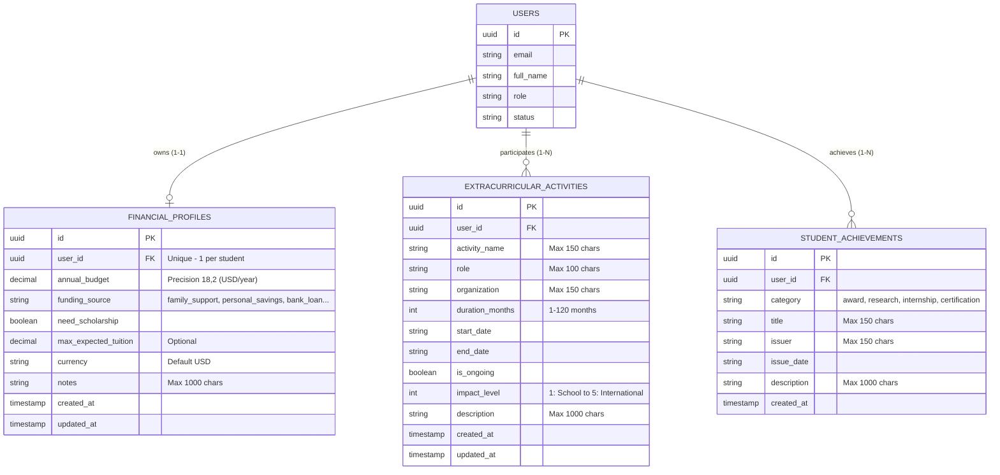

# REPORT 3 (SRS) CONTRIBUTION – NGUYỄN XUÂN ĐỨC
## FEATURE: USAS-364 (Hồ sơ Tài chính và Hoạt động Ngoại khóa)

Tài liệu này được biên soạn chuẩn theo template Report 3 (SRS) của môn học Capstone Fall 2026, tương ứng với phần việc của **Nguyễn Xuân Đức** cho chức năng **USAS-364**.

---

### MỤC I. 3. CONCEPTUAL & LOGICAL DATA MODEL (Đức phụ trách viết bản đầu)

#### 3.1. Sơ đồ Quan hệ Thực thể (ERD)

#### 3.2. Mô tả Thực thể (Entity Descriptions)
1. **`financial_profiles` (Hồ sơ tài chính):**
   * Lưu trữ khả năng chi trả tài chính du học của gia đình học sinh mỗi năm. Dữ liệu này là đầu vào bắt buộc để AI ở bước B3–B4 tính toán mức độ phù hợp về tài chính và phân loại trường Reach/Match/Safety.
2. **`extracurricular_activities` (Hoạt động ngoại khóa & lãnh đạo):**
   * Lưu trữ các hoạt động ngoại khóa, dự án cộng đồng, câu lạc bộ và vai trò lãnh đạo. Trường `impact_level` (1 đến 5) phản ánh quy mô ảnh hưởng từ cấp trường đến quốc tế, phục vụ thuật toán chấm điểm ngoại khóa kiểu Mỹ (Holistic Review) ở Sprint 2.
3. **`student_achievements` (Giải thưởng & nghiên cứu):**
   * Lưu trữ các thành tích học sinh giỏi, giải thưởng nghiên cứu khoa học, chứng chỉ và kinh nghiệm thực tập làm dày hồ sơ xin học bổng.

---

### MỤC II. USE CASE SPECIFICATION

* **Use Case ID:** `UC-03`
* **Use Case Name:** Khai báo và quản lý hồ sơ tài chính & ngoại khóa
* **Actor:** Học sinh (Student), Phụ huynh (Parent)
* **Pre-conditions:** Người dùng đã đăng ký và đăng nhập vào hệ thống.
* **Post-conditions:** Thông tin tài chính và danh sách hoạt động ngoại khóa được lưu trữ an toàn trong cơ sở dữ liệu và sẵn sàng cho AI Advisor phân tích.

#### Main Flow (Luồng chính):
1. Người dùng truy cập trang "Tài chính & Ngoại khóa" (`/profile/financial`).
2. Hệ thống tải thông tin tài chính hiện tại và danh sách hoạt động đã lưu của người dùng.
3. Người dùng nhập ngân sách hàng năm, chọn nguồn tài chính, chọn nhu cầu học bổng và bấm "Lưu hồ sơ tài chính".
4. Hệ thống kiểm tra hợp lệ dữ liệu (ngân sách $\ge 0$ và $\le 10,000,000$, nguồn tiền không rỗng).
5. Hệ thống thực hiện lưu/cập nhật (Upsert) và hiển thị thông báo thành công màu xanh.
6. Người dùng bấm "+ Thêm hoạt động", điền tên hoạt động, vai trò, quy mô ảnh hưởng (1-5) và bấm "Thêm hoạt động".
7. Hệ thống validate và lưu hoạt động, danh sách trên màn hình tự động cập nhật ngay lập tức.

#### Alternative Flows (Luồng phụ / Xử lý ngoại lệ):
* **A1: Người dùng nhập ngân sách âm:** Hệ thống chặn ngay tại Client và nếu gửi qua API sẽ trả về lỗi `400 Bad Request: Ngân sách hàng năm phải từ 0 đến 10,000,000 USD`.
* **A2: Người dùng sửa hoặc xóa hoạt động:** Hệ thống kiểm tra quyền sở hữu (`UserId == CurrentUser.Id`). Nếu không phải chính chủ, hệ thống chặn với lỗi `404/403` (Chống IDOR).

---

### MỤC III. FUNCTIONAL REQUIREMENTS (Màn hình & Bảng Field)

* **Screen ID:** `SCR-PROFILE-01`
* **Screen Name:** Quản lý Hồ sơ Tài chính và Hoạt động Ngoại khóa
* **URL:** `/profile/financial`

| Tên trường (Field Name) | Kiểu dữ liệu | Bắt buộc? | Ràng buộc / Validation | Giá trị mặc định | Mô tả |
| :--- | :--- | :--- | :--- | :--- | :--- |
| `annualBudget` | Number (Decimal) | Có | Min: 0, Max: 10,000,000 | 30000 | Ngân sách chi trả mỗi năm (USD/năm) |
| `fundingSource` | Dropdown | Có | Thuộc danh mục (family, savings, loan...) | family_support | Nguồn tài chính chính |
| `needScholarship` | Checkbox (Bool) | Không | True / False | True | Nhu cầu nhận học bổng |
| `maxExpectedTuition`| Number (Decimal) | Không | Min: 0, Max: 10,000,000 | Null | Học phí mong muốn tối đa |
| `activityName` | String | Có | 2 - 150 ký tự | "" | Tên hoạt động ngoại khóa |
| `role` | String | Có | 1 - 100 ký tự | "" | Vai trò trong hoạt động |
| `impactLevel` | Dropdown (Int) | Có | Giá trị từ 1 đến 5 | 1 | Quy mô ảnh hưởng của hoạt động |
| `durationMonths` | Number (Int) | Không | 1 - 120 tháng | Null | Số tháng tham gia |

---

### MỤC V. BUSINESS RULES & SYSTEM MESSAGES

#### 1. Business Rules
* `BR-FIN-01`: Mỗi tài khoản học sinh chỉ sở hữu duy nhất 1 hồ sơ tài chính (`user_id` là Unique). Mọi thao tác lưu tiếp theo là Cập nhật (Upsert).
* `BR-FIN-02`: Ngân sách du học không được là số âm và không vượt quá 10,000,000 USD/năm.
* `BR-ACT-01`: Quy mô ảnh hưởng của hoạt động ngoại khóa bắt buộc nằm trong thang điểm 1 đến 5 (1: Trường/CLB, 2: Quận/Huyện, 3: Tỉnh/TP, 4: Quốc gia, 5: Quốc tế).
* `BR-SEC-01 (Bảo mật IDOR)`: API không nhận `userId` từ Client để quyết định quyền sở hữu. Hệ thống tự trích xuất `userId` từ phiên đăng nhập. Người dùng không thể xem, sửa hoặc xóa dữ liệu của người khác.

#### 2. System Messages
* `MSG-FIN-SUCCESS`: "Đã lưu thông tin tài chính thành công!" (HTTP 200)
* `MSG-FIN-ERR-BUDGET`: "Ngân sách hàng năm phải từ 0 đến 10,000,000 USD." (HTTP 400)
* `MSG-ACT-ERR-NAME`: "Tên hoạt động không được để trống (2 đến 150 ký tự)." (HTTP 400)
* `MSG-AUTH-UNAUTHORIZED`: "Vui lòng đăng nhập để truy cập thông tin hồ sơ." (HTTP 401)
* `MSG-FORBIDDEN-IDOR`: "Không tìm thấy hoạt động hoặc bạn không có quyền chỉnh sửa." (HTTP 404/403)
