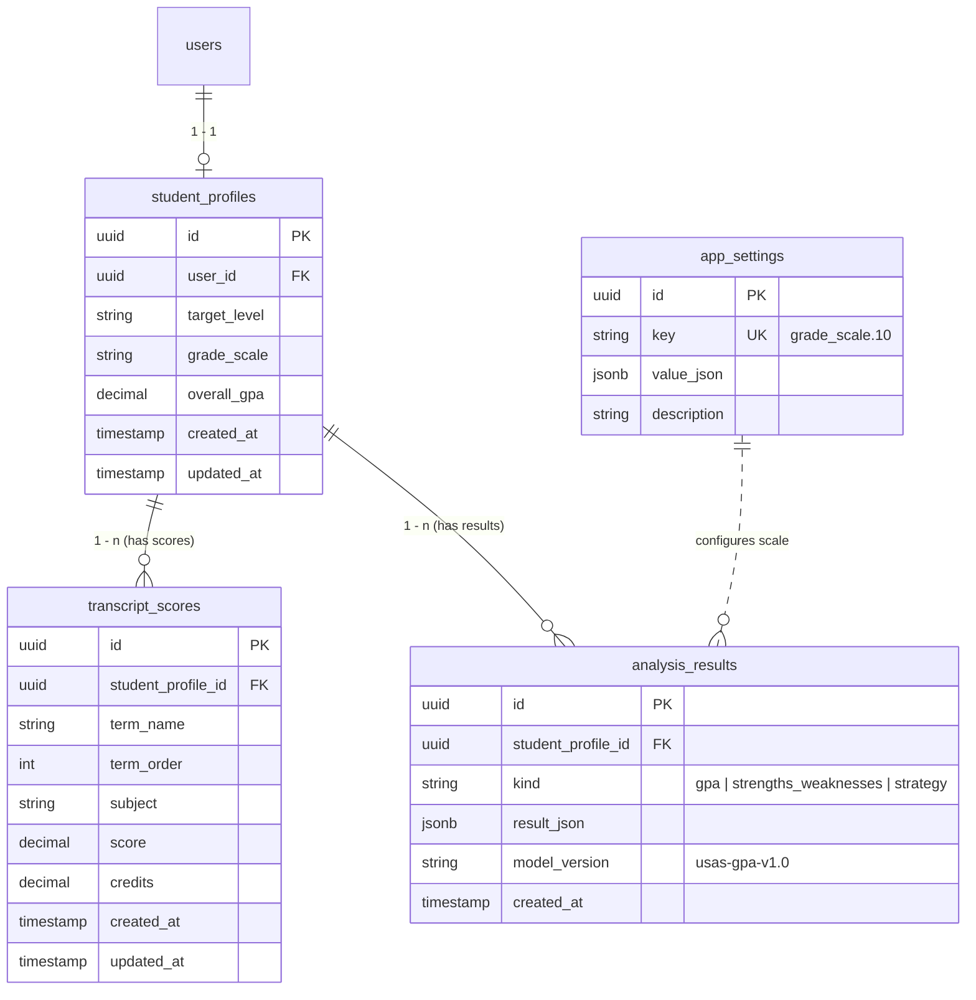

# TÀI LIỆU ĐẶC TẢ YÊU CẦU PHẦN MỀM (SRS) - BÁO CÁO REPORT 3
## CHỨC NĂNG USAS-365: PHÂN TÍCH ĐIỂM HỌC THUẬT & QUY ĐỔI GPA
**Sinh viên phụ trách:** Nguyễn Xuân Đức  
**Mã phân hệ:** Profile & Academic Analysis Module  
**Giai đoạn:** Sprint 1 (01/10/2026 - 08/10/2026)

---

### I. MÔ HÌNH DỮ LIỆU & THỰC THỂ (ERD & Data Dictionary)

#### 1. Sơ đồ thực thể liên quan (Mermaid ERD)

#### 2. Từ điển dữ liệu (Data Dictionary)

| Bảng | Tên cột | Kiểu dữ liệu | Nullable | Ràng buộc nghiệp vụ & Ý nghĩa |
| :--- | :--- | :--- | :---: | :--- |
| `student_profiles` | `id` | UUID | Không | Khóa chính của hồ sơ học sinh |
| `student_profiles` | `user_id` | UUID | Không | Khóa ngoại trỏ tới `users.id`, quan hệ 1-1, chống IDOR |
| `student_profiles` | `overall_gpa` | Decimal(3,2) | Có | GPA hệ 4.0 được đồng bộ tự động sau khi chạy phân tích |
| `transcript_scores` | `id` | UUID | Không | Khóa chính của bản ghi điểm môn |
| `transcript_scores` | `student_profile_id`| UUID | Không | Khóa ngoại trỏ về hồ sơ học sinh (Cascade delete) |
| `transcript_scores` | `term_name` | Varchar(64) | Không | Tên học kỳ hiển thị (VD: "Lớp 10 HK1", "Lớp 11 HK2") |
| `transcript_scores` | `term_order`| Integer | Không | Thứ tự thời gian của học kỳ (từ 1 đến 20) |
| `transcript_scores` | `subject` | Varchar(128) | Không | Tên môn học (VD: "Toán", "Vật lý", "Tiếng Anh") |
| `transcript_scores` | `score` | Decimal(4,2) | Không | Điểm số hệ 10, ràng buộc $0.0 \le score \le 10.0$ |
| `transcript_scores` | `credits` | Decimal(4,1) | Có | Số tín chỉ hoặc hệ số môn học (nếu có, $> 0$) |
| `analysis_results` | `id` | UUID | Không | Khóa chính của kết quả phân tích |
| `analysis_results` | `kind` | Varchar(32) | Không | Định danh loại phân tích: `"gpa"` cho USAS-365 |
| `analysis_results` | `result_json` | JSONB | Không | Nội dung JSON lưu chi tiết GPA, phân nhóm, xu hướng |
| `analysis_results` | `model_version` | Varchar(64) | Có | Phiên bản thuật toán: `"usas-gpa-v1.0"` |
| `app_settings` | `key` | Varchar(64) | Không | Khóa cấu hình (`grade_scale.10`), duy nhất (Unique) |

---

### II. ĐẶC TẢ USE CASE (Use Case Specification)

#### Use Case: UC-04 – Phân tích điểm học thuật và quy đổi GPA 4.0

* **Mã Use Case:** `UC-04`
* **Tên Use Case:** Phân tích năng lực học thuật và quy đổi GPA
* **Tác nhân chính (Primary Actor):** Học sinh / Phụ huynh (Người dùng đã đăng nhập)
* **Tiền điều kiện (Preconditions):**
  1. Người dùng đã đăng nhập vào hệ thống và có `UserId` hợp lệ.
  2. Học sinh đã có hồ sơ trong bảng `student_profiles`.
* **Kích hoạt (Trigger):** Người dùng bấm nút "⚡ Phân tích điểm học thuật" trên màn hình `/profile/academic`.
* **Luồng sự kiện chính (Main Flow):**
  1. Hệ thống lấy danh sách bảng điểm `transcript_scores` của học sinh dựa theo `UserId` từ Token (Anti-IDOR).
  2. Hệ thống kiểm tra cấu hình thang điểm quy đổi từ bảng `app_settings` (`key = "grade_scale.10"`). Nếu chưa cấu hình, hệ thống áp dụng bảng quy đổi WES (World Education Services) chuẩn.
  3. Hệ thống tính toán điểm môn học quy đổi sang thang 4.0:
     - Dò theo bảng khoảng điểm hoặc công thức tuyến tính được cấu hình.
  4. Hệ thống tính toán **Unweighted GPA**:
     $$GPA_{unweighted} = \frac{\sum_{i=1}^N GPA4_i}{N}$$
  5. Hệ thống tính toán **Weighted GPA**:
     - Nếu có tín chỉ: tính theo trọng số tín chỉ $\frac{\sum (GPA4_i \times Credits_i)}{\sum Credits_i}$.
     - Nếu là môn chuyên/nâng cao (AP, Honors): cộng thưởng 0.5 điểm (tối đa 4.5).
  6. Hệ thống phân loại môn học vào 3 nhóm chính:
     - **Khoa học Tự nhiên (STEM):** Toán, Lý, Hóa, Sinh, Tin, Công nghệ.
     - **Khoa học Xã hội & Nhân văn:** Văn, Sử, Địa, GDCD, Triết, Kinh tế.
     - **Ngoại ngữ:** Tiếng Anh, Pháp, Trung, Nhật, Hàn.
     - Tính điểm trung bình hệ 10 và GPA 4.0 cho từng nhóm.
  7. Hệ thống sắp xếp các kỳ theo `term_order` và đánh giá xu hướng 3 năm:
     - So sánh điểm nửa sau với nửa đầu chuỗi kỳ học.
     - Xác định: `upward` (tiến bộ), `consistent` (ổn định), `downward` (giảm sút).
  8. Hệ thống lưu kết quả phân tích vào bảng `analysis_results` (`kind = "gpa"`), cập nhật `overall_gpa` trong `student_profiles`.
  9. Hệ thống trả về DTO kết quả và hiển thị trực quan lên giao diện kèm dòng khuyến cáo tham khảo.
* **Luồng ngoại lệ (Alternative Flows):**
  - **A1. Học sinh chưa nhập điểm môn nào:** Hệ thống thông báo học sinh nạp điểm hoặc bấm "Nạp dữ liệu mẫu (3 năm)" để trải nghiệm.
  - **A2. Điểm số nhập sai định dạng ($< 0$ hoặc $> 10$):** Hệ thống từ chối lưu và trả về mã lỗi 400 ProblemDetails giải thích rõ ràng.
* **Hậu điều kiện (Postconditions):**
  - Bảng `analysis_results` ghi nhận 1 bản ghi mới với `model_version = "usas-gpa-v1.0"`.
  - Cột `student_profiles.overall_gpa` được đồng bộ, sẵn sàng làm đầu vào cho chức năng AI gợi ý trường (#5 của bạn Dũng).

---

### III. ĐẶC TẢ GIAO DIỆN (Screen Specification: SCR-PROFILE-02)

**Mã màn hình:** `SCR-PROFILE-02`  
**Tên màn hình:** Phân tích điểm học thuật & GPA Dashboard  
**Đường dẫn (URL):** `/profile/academic`

#### Bảng mô tả trường thông tin (Field Specification Table)

| STT | Mã trường | Nhãn hiển thị | Kiểu giao diện | Bắt buộc | Quy tắc kiểm tra (Validation Rules) | Hành vi / Nghiệp vụ |
| :---: | :--- | :--- | :--- | :---: | :--- | :--- |
| 1 | `fld_term` | Học kỳ | Select Dropdown | Có | Giá trị từ danh sách 6 kỳ chuẩn (Lớp 10 HK1 $\rightarrow$ Lớp 12 HK2) | Xác định thứ tự thời gian `term_order` |
| 2 | `fld_subject` | Tên môn học | Text Input + Datalist | Có | Tối đa 128 ký tự, không được để trống | Gợi ý môn học thông dụng và tự động phân nhóm |
| 3 | `fld_score` | Điểm hệ 10 | Number Input | Có | Số thực, $0.0 \le score \le 10.0$, bước nhảy 0.1 | Điểm thành phần môn học |
| 4 | `fld_credits` | Tín chỉ / Hệ số | Number Input | Không | Số thực dương $> 0$ và $\le 30$ | Dùng để tính Weighted GPA |
| 5 | `btn_add` | + Thêm môn | Button Primary | - | Kiểm tra hợp lệ trước khi đẩy vào danh sách | Lưu vào bảng điểm tạm thời |
| 6 | `btn_sample` | 📋 Nạp dữ liệu mẫu | Button Secondary | - | Hiển thị hộp thoại xác nhận | Nạp tự động 25 môn học 3 năm |
| 7 | `btn_analyze` | ⚡ Phân tích điểm | Button Action | - | Bị vô hiệu hóa nếu bảng điểm rỗng hoặc đang phân tích | Gọi API `POST /api/v1/profile/academic/analyze` |
| 8 | `card_unweighted`| Unweighted GPA | Display Card | - | Định dạng `X.XX / 4.0` | Thang 4.0 chuẩn không trọng số |
| 9 | `card_weighted` | Weighted GPA | Display Card | - | Định dạng `X.XX / 4.0` | Thang 4.0 có trọng số |
| 10| `badge_trend` | Xu hướng học tập | Status Badge | - | Upward (Xanh lá) / Consistent (Xanh dương) / Downward (Vàng) | Nhận xét xu hướng kèm giải thích |
| 11| `sec_groups` | Phân tích nhóm môn | 3 Cards Grid | - | Tự nhiên, Xã hội, Ngoại ngữ | Thanh phần trăm trực quan và danh sách môn |
| 12| `sec_trend_chart`| Biểu đồ kỳ học | Bar Chart Component | - | 6 cột biểu diễn điểm từng kỳ | Thể hiện đà tăng trưởng qua 3 năm |
| 13| `box_disclaimer` | Lưu ý tham khảo | Alert Box Warning | - | Cố định | Bắt buộc hiển thị theo SOW v6 |

---

### IV. HƯỚNG DẪN BẢO VỆ ĐỒ ÁN TRƯỚC HỘI ĐỒNG (Defense Preparation Q&A)

#### Câu hỏi 1: Thầy hỏi "Thuật toán quy đổi GPA của em lấy từ đâu? Tại sao lại có cả Unweighted và Weighted GPA?"
* **Trả lời:**
  - *"Dạ thưa Thầy, theo tài liệu Scope of Work v6 của đề tài, hệ thống mặc định cung cấp 2 cơ chế quy đổi: cơ chế bậc thang theo chuẩn WES (World Education Services - tổ chức thẩm định học bạ uy tín nhất cho du học Mỹ) và công thức tuyến tính $Điểm \times 0.4$. Toàn bộ bảng quy đổi được đọc động từ bảng `app_settings` (`key = grade_scale.10`), tuyệt đối không hardcode trong code."*
  - *"Về hai loại GPA: **Unweighted GPA** phản ánh điểm trung bình thuần túy của toàn bộ môn học trên thang 4.0, là tiêu chuẩn tối thiểu các trường Mỹ xét hồ sơ; còn **Weighted GPA** tính thêm trọng số tín chỉ hoặc cộng thưởng 0.5 điểm cho các môn chuyên / môn nâng cao (AP, Honors), phản ánh độ khó của chương trình học mà học sinh đã chinh phục."*

#### Câu hỏi 2: Thầy hỏi "Em phân loại nhóm môn học như thế nào và xu hướng 3 năm có ý nghĩa gì đối với việc du học Mỹ?"
* **Trả lời:**
  - *"Dạ thưa Thầy, hàm `ClassifySubjectGroup` trong backend tự động chuẩn hóa chuỗi (bỏ dấu tiếng Việt, phân tách từ) để phân chia môn học vào 3 nhóm chiến lược: Khoa học Tự nhiên (STEM), Khoa học Xã hội & Nhân văn, và Ngoại ngữ. Điều này giúp đánh giá độ phù hợp ngành (Major Fit), ví dụ học sinh nộp Computer Science thì điểm STEM phải vượt trội."*
  - *"Về xu hướng 3 năm: Hội đồng tuyển sinh Mỹ rất coi trọng **Growth Mindset**. Một học sinh lớp 10 điểm 7.5 nhưng lớp 12 vươn lên 9.2 (Upward Trend) sẽ được đánh giá cao hơn nhiều so với học sinh điểm cao nhưng tụt dốc. Thuật toán so sánh biến động điểm giữa các kỳ để phát hiện xu hướng và đưa ra lời khuyên cho bài luận cá nhân SOP."*

#### Câu hỏi 3: Thầy hỏi "Hệ thống bảo mật dữ liệu điểm số và ngăn chặn gian lận điểm số như thế nào?"
* **Trả lời:**
  - *"Dạ thưa Thầy, hệ thống áp dụng cơ chế **Anti-IDOR (Insecure Direct Object References)** triệt để: Mọi API lưu điểm hay phân tích đều trích xuất `UserId` từ JWT Token ở tầng Controller, người dùng không thể can thiệp hay sửa điểm của học sinh khác bằng cách truyền `profileId` giả mạo. Đồng thời, backend áp dụng Defensive Validation kiểm soát nghiêm ngặt biên điểm $[0.0, 10.0]$ và số tín chỉ hợp lệ."*
